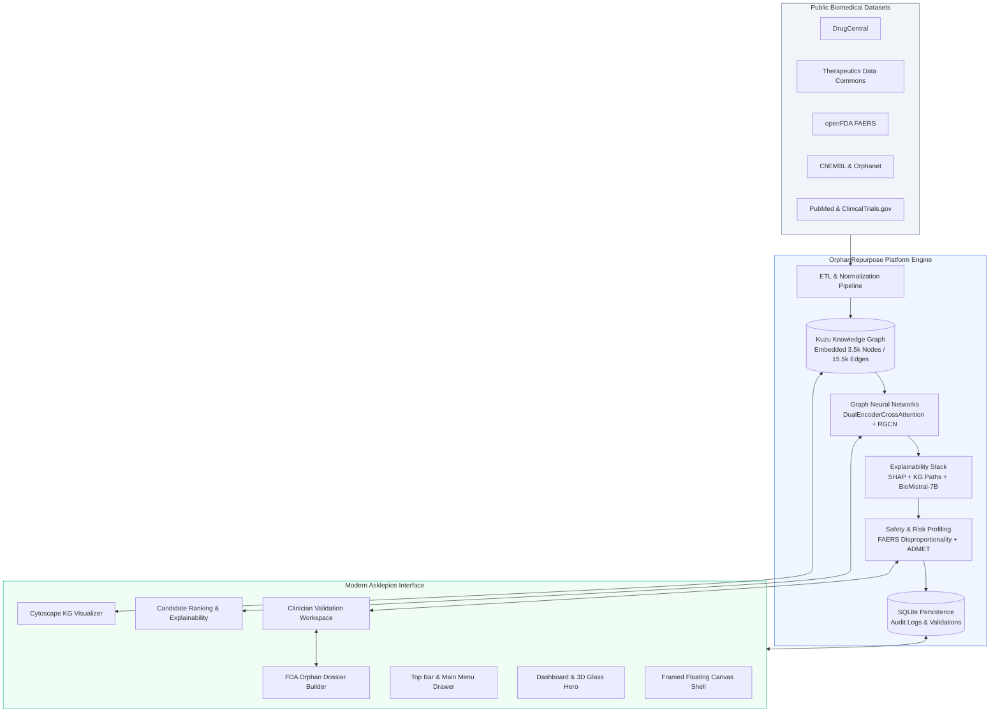

# OrphanRepurpose – AI-Driven Drug Repurposing for Rare & Orphan Diseases

> **Accelerating therapeutic discoveries for rare diseases by repurposing existing drugs with explainable AI and modern clinical intelligence.**

OrphanRepurpose is an end-to-end AI platform that identifies, explains, and validates drug repurposing opportunities for rare and orphan diseases. It pairs an embedded rare-disease knowledge graph with graph neural networks, multimodal clinical safety data (FAERS, ADMET), clinician-in-the-loop review trails, and the modern **Asklepios** frosted-glass clinical interface.

[](https://opensource.org/licenses/MIT)
[](https://www.python.org/downloads/)
[](https://react.dev/)
[](https://www.typescriptlang.org/)
[](https://vitejs.dev/)
[](https://tailwindcss.com/)
[](https://fastapi.tiangolo.com/)
[](https://pytorch.org/)
[](https://kuzudb.com/)
[](https://js.cytoscape.org/)
[](https://github.com/topics/ai-for-healthcare)
[](https://github.com/topics/drug-repurposing)
[](https://github.com/topics/explainable-ai)

---

<details>
<summary>Table of Contents</summary>

- [The Problem](#the-problem)
- [Our Solution](#our-solution)
- [Why OrphanRepurpose?](#why-orphanrepurpose)
- [Modern Asklepios Interface](#modern-asklepios-interface)
- [Key Features](#key-features)
- [Results & Model Performance](#results--model-performance)
  - [What Do These Results Mean?](#what-do-these-results-mean)
- [System Architecture](#system-architecture)
- [Tech Stack](#tech-stack)
- [Project Structure](#project-structure)
- [Getting Started](#getting-started)
  - [Prerequisites](#prerequisites)
  - [Local Development Setup](#local-development-setup)
  - [Running with Docker](#running-with-docker)
  - [Testing & Quality Verification](#testing--quality-verification)
- [Core Platform Modules](#core-platform-modules)
- [Makefile Automation](#makefile-automation)
- [Roadmap](#roadmap)
- [Open-Source & Contribution](#open-source--contribution)
- [Citation](#citation)
- [License](#license)
- [Contact](#contact)

</details>

---

## The Problem

There are **7,000+ rare diseases** affecting over **300 million people worldwide**, yet only **~5% have an approved treatment**. Pharmaceutical companies often overlook rare diseases due to small patient populations, high development costs, and uncertain returns. This leaves millions without viable therapies.

Traditional drug discovery takes **10–15 years** and costs **over $2.6 billion** per approved drug. For rare diseases, this model is economically unsustainable, creating a critical gap in medical innovation.

## Our Solution

OrphanRepurpose flips the script by **repurposing existing approved drugs**—bypassing early-stage toxicity and pharmacokinetic unknowns—to rapidly identify new therapeutic indications for rare diseases. The platform combines:

- A **curated rare-disease knowledge graph** (embedded Kuzu DB) that captures biological relationships across diseases, drugs, targets, and pathways.
- **Multimodal public biomedical datasets** (DrugCentral, TDC, FAERS, ChEMBL, ClinicalTrials.gov, PubMed).
- **Graph neural networks** (DualEncoderCrossAttention, SimpleIndicationModel_MLP) predicting drug-disease indications.
- **Explainable AI (XAI)** (SHAP attributions, KG path traversals, BioMistral-7B clinical rationales).
- **Safety filtering** using FAERS adverse event reports (openFDA PRR/ROR) and TDC/RDKit ADMET predictions.
- **Clinician-in-the-loop validation** with SQLite-persisted audit trails.
- **Automated dossier generation** aligned with FDA Orphan Drug Designation requirements.
- **Modern Asklepios Web UI** built with frosted-glass components, framed canvas architecture, and responsive Cytoscape network exploration.

This approach reduces discovery timelines from years to months and cuts costs by >90%, making rare disease therapeutics feasible.

---

## Why OrphanRepurpose?

Unlike typical drug repurposing repositories that rely on static CSV files or black-box predictions, OrphanRepurpose delivers an **auditable, clinician-ready system**:

- **Real knowledge graph** – embedded Kuzu graph with browsable nodes and edges, not a flat spreadsheet.
- **GNN-based indication prediction** – leveraging graph relational structure for high-confidence predictions.
- **Explainability-first design** – SHAP feature attributions, graph paths, counterfactual insights, and BioMistral-7B generated rationales.
- **Safety-aware filtering** – integrates FAERS adverse event signals and ADMET predictions to weed out toxic candidates early.
- **Clinician-in-the-loop oversight** – dedicated review interface with persistent audit logs, tracking reviewer decisions and rationale.
- **FDA-oriented auditability** – automated dossier compilation designed around FDA Orphan Drug Designation criteria.
- **Modern Asklepios Interface** – high-fidelity frosted-glass healthcare interface, responsive canvas shell, and interactive Cytoscape network visualization.

---

## Modern Asklepios Interface

The platform features an **Asklepios-inspired clinical design system** crafted for clarity, clinical focus, and fluid interaction:

1. **Framed Floating Canvas**: The application resides in an elevated, rounded card (`rounded-[32px]`, `shadow-2xl`) suspended against a soft slate backdrop (`#eef2f6`).
2. **Spacious Top Navigation**: Clean geometric branding (`+ orphan repurpose`), active pill links, benchmark disease quick-switchers (**NPC `ORPHA:635`**, **Cystic Fibrosis `ORPHA:793`**), live backend health telemetry pulse, and a slide-over `Main Menu` drawer.
3. **Signature Frosted 3D Glass Hero**: Pure CSS/SVG layered frosted glass slabs with cyan/ice-blue gradients, real-time platform telemetry chips (1,645 drugs, 1,470 diseases, 15.5k edges, 91.7% Recall@20), and instant exploration action buttons.
4. **Interactive Cytoscape KG Browser**: Real-time graph visualization with physics layout, node/edge inspection, degree metrics, search filters, and neighbor expansion.
5. **Clinician Validation & Dossier Builder**: Elevated review cards with decision buttons (Approve / Reject / Flag), confidence threshold controls, and one-click regulatory dossier exports.

---

## Key Features

- **Embedded Knowledge Graph (Kuzu)**: Dynamic querying and traversal of drugs, diseases, targets, pathways, and indications.
- **High-Performance GNN Indication Prediction**: Dual-encoder cross-attention model achieving **91.7% Recall@20** on ChEMBL-augmented benchmarks.
- **Multi-Modal Explainability**: Combines SHAP feature attributions, path traversal in the knowledge graph, and BioMistral-7B natural language rationales.
- **Safety & Disproportionality Scoring**: OpenFDA FAERS adverse event signal detection (PRR/ROR) + RDKit/TDC ADMET property filtering.
- **Clinician Validation Workspace**: Dedicated review portal with confidence thresholds, clinical annotations, and SQLite audit logging.
- **Deterministic Candidate Identity**: Candidate IDs derive from the disease–drug pair, so rankings can change without breaking stored reviews, links, or dossier references.
- **Fail-Closed Dossier Selection**: Dossier generation accepts candidate *or* drug IDs and returns HTTP 400 for unknown selections instead of silently emitting an empty dossier.
- **Tamper-Evident Audit Persistence**: Hash-chained audit entries are written under a `BEGIN IMMEDIATE` lock and always verified against the persisted store, so cross-process writes and tampering are visible.
- **Automated Dossier Generator**: Aggregates credibility scores, literature citations, and safety profiles into FDA Orphan Drug Designation draft packages.
- **Benchmarked Disease Case Studies**: Curated walkthroughs for **Niemann-Pick Type C (Miglustat)** and **Cystic Fibrosis (Ivacaftor)**.
- **Production-Ready Full-Stack**: FastAPI backend with async SQLAlchemy, Vite + React frontend with Tailwind CSS and Cytoscape.js.

---

## Results & Model Performance

OrphanRepurpose achieves strong predictive performance on a ChEMBL-augmented benchmark, ranking true indications at the top of candidate lists.

| Metric | Score | Target | Status |
|--------|-------|--------|--------|
| **Recall@20** | **91.7%** | $\ge 70\%$ | ✅ Exceeded |
| **Recall@10** | **78.5%** | — | — |
| **Recall@50** | **98.1%** | — | — |
| **Recall@100** | **99.6%** | — | — |
| **AUPRC** | **0.817** | — | — |
| **AUROC** | **0.807** | — | — |
| **Expected Calibration Error (ECE)** | **0.050** | $\le 0.10$ | ✅ Well-calibrated |

### Knowledge Graph Statistics

| Entity / Edge Type | Count |
|--------------------|-------|
| Drugs | 1,645 |
| Diseases | 1,470 |
| Known Indications | 14,578 |
| Drug-Target Edges | 915 |
| Total Graph Nodes | 3,532 |
| Total Graph Edges | 15,504 |

### What Do These Results Mean?

High Recall@K indicates that the model places true therapeutic indications in the top $K$ predictions. For researchers and clinicians, a **Recall@20 of 91.7%** means that reviewing only the top 20 candidates uncovers over 9 out of 10 known efficacious treatments—dramatically reducing manual screening effort and focusing experimental validation where it matters most.

---

## System Architecture

Data flows from heterogeneous biomedical sources through an automated ETL pipeline into the embedded Kuzu graph. Graph neural networks generate indication scores, which are passed through explainability and safety filters before reaching clinician review and regulatory dossier export.



---

## Tech Stack

| Layer | Technologies |
|-------|--------------|
| **Frontend UI** | React 18, TypeScript, Vite, Tailwind CSS (Asklepios frosted-glass tokens), Cytoscape.js, Lucide Icons, Axios |
| **Backend API** | Python 3.11+, FastAPI (REST endpoints with OpenAPI `/docs`), SQLAlchemy 2.0 (async SQLite via `aiosqlite`), Pydantic v2, Structlog |
| **Knowledge Graph** | Kuzu DB (embedded columnar graph engine), Cypher query language, RGCN graph embeddings |
| **Graph AI / ML** | PyTorch, PyTorch Geometric, DualEncoderCrossAttention, GraphSAGE, SimpleIndicationModel_MLP |
| **Explainability (XAI)** | SHAP feature attributions, Graph path extraction, Counterfactual analysis, BioMistral-7B LLM rationales |
| **Safety & Toxicology** | openFDA FAERS disproportionality (PRR/ROR), TDC ADMET benchmarks, RDKit molecular descriptors |
| **Vector Search** | ChromaDB (PubMed abstract semantic indexing) |
| **Infrastructure** | Docker, Docker Compose, GNU Make |

---

## Project Structure

```
orphan-repurpose/
├── docs/                      # Technical specifications, plans, and architectural docs
├── data/                      # Raw and processed datasets (gitignored)
├── models/                    # Trained GNN checkpoints and embeddings (gitignored)
├── prototype/
│   ├── backend/               # FastAPI backend application
│   │   ├── app/
│   │   │   ├── api/v1/        # Endpoints: diseases, candidates, kg, literature, validation, dossier, audit
│   │   │   ├── core/          # Configuration (pydantic-settings), structured logging
│   │   │   ├── db/            # SQLAlchemy models, SQLite engine, migrations
│   │   │   ├── ml/            # Indication models, SHAP explainer, featurizer, FAERS, ADMET
│   │   │   ├── models/        # Pydantic request and response schemas
│   │   │   └── services/      # Business logic (kg_service, indication_service, dossier_service, etc.)
│   │   ├── tests/             # Pytest test suite (asyncio, unit and integration tests)
│   │   └── pyproject.toml     # Backend dependencies and build configuration
│   └── frontend/              # Asklepios Modern React/Vite web application
│       ├── src/
│       │   ├── components/    # Glassmorphic UI (GlassHero, Navbar, MainMenuDrawer, KGBrowser, etc.)
│       │   ├── services/      # Typed Axios API client
│       │   ├── types/         # TypeScript interfaces and domain schemas
│       │   ├── App.tsx        # Framed canvas layout and client routing
│       │   └── index.css      # Glassmorphic Tailwind utilities and animations
│       ├── tailwind.config.js # Custom design tokens and frosted glass blurs
│       ├── package.json       # Frontend dependencies and scripts
│       └── vite.config.ts     # Vite configuration with `/api` backend proxy
├── scripts/
│   ├── download/              # Data acquisition scripts (Orphanet, DrugCentral, TDC, FAERS, ChEMBL)
│   └── etl/                   # Parquet processing, KG construction, and model training
├── docker-compose.yml         # Container orchestration for backend & frontend
├── Makefile                   # Developer workflow, pipeline, and testing targets
└── README.md
```

---

## Getting Started

Get OrphanRepurpose running locally in under 5 minutes.

### Prerequisites

- **Python 3.11+** (3.11 or 3.13 recommended)
- **Node.js 20+** & **npm**
- **Docker** & **Docker Compose** (optional for containerized run)
- **Git**

### Local Development Setup

1. **Clone the repository:**
   ```bash
   git clone https://github.com/somenathjana21-ops/orphan-repurpose.git
   cd orphan-repurpose
   ```

2. **Install backend dependencies:**
   ```bash
   cd prototype/backend
   pip install -e ".[dev]"
   cd ../..
   # Or run: make install-backend
   ```

3. **Install frontend dependencies:**
   ```bash
   cd prototype/frontend
   npm install
   cd ../..
   # Or run: make install-frontend
   ```

4. **Launch development servers:**
   - **Terminal 1 (Backend API):**
     ```bash
     make dev-backend
     # Starts FastAPI on http://localhost:8000 with interactive Swagger docs at http://localhost:8000/docs
     ```
   - **Terminal 2 (Frontend UI):**
     ```bash
     make dev-frontend
     # Starts Vite on http://localhost:3000 (proxies /api and /health requests to :8000)
     ```

### Running with Docker

To run the complete full-stack environment in Docker:

```bash
make run
```

- **Frontend:** [http://localhost:3000](http://localhost:3000)
- **Backend API:** [http://localhost:8000](http://localhost:8000)
- **Interactive API Docs:** [http://localhost:8000/docs](http://localhost:8000/docs)

To stop services:
```bash
make clean
```

### Testing & Quality Verification

```bash
# Run pytest with code coverage (enforces 80% coverage floor)
make test

# Run unit tests only
make test-unit

# Run linters (ruff + mypy for backend, eslint for frontend)
make lint

# Run endpoint health verification and artifact checks
make verify
```

---

## Core Platform Modules

| Module | Route | Capabilities |
|--------|-------|--------------|
| **Dashboard** | `/` | Overview of rare disease therapeutic landscape, Asklepios 3D frosted-glass hero, platform metrics, and benchmark disease cards. |
| **Disease Explorer** | `/diseases/:id` | Detailed disease view with clinical phenotypes, associated genes, unmet medical need scoring, and candidate generation triggers. |
| **Candidate Ranking** | `/diseases/:id/candidates` | Ranked repurposing candidates with confidence scores, confidence intervals, approval status, and mechanism of action tags. |
| **Explainable AI (XAI)** | `/candidates/:id/detail` | SHAP feature attributions, counterfactual analysis, KG traversal paths, and natural language clinical rationales. |
| **Knowledge Graph Browser** | `/kg` | Interactive Cytoscape network visualizer with physics layout, node filtering, multi-hop path search, and graph statistics. |
| **Case Studies** | `/case-studies` | Validated benchmark walkthroughs for **Niemann-Pick Type C (Miglustat)** and **Cystic Fibrosis (Ivacaftor)**. |
| **Clinician Validation** | `/validation` | Decision recording interface (Approve / Reject / Flag) with clinical notes and persistent SQLite audit trails. |
| **Dossier Builder** | `/dossier` | One-click aggregation of regulatory evidence into an FDA Orphan Drug Designation draft with credibility metrics. Candidate selection accepts either candidate IDs or drug IDs; unknown selections are rejected with HTTP 400. When the PDF renderer is unavailable the UI states this and JSON export remains available. |
| **Audit Trail** | `/api/v1/audit` | Hash-chained, tamper-evident audit entries persisted in SQLite, verified against the stored chain on every read. `GET /sessions` lists all recorded sessions. |

---

## Makefile Automation

| Target | Description |
|--------|-------------|
| `make setup` | Run full automated pipeline: download data, process Parquet, build KG, train embeddings, train model |
| `make run` | Launch containerized backend (:8000) and frontend (:3000) via Docker Compose |
| `make dev-backend` | Start FastAPI with live reload on `:8000` |
| `make dev-frontend` | Start Vite frontend with live reload on `:3000` |
| `make test` | Run pytest test suite with coverage enforcement (`--cov-fail-under=80`) |
| `make test-unit` | Run unit tests only |
| `make test-integration` | Run integration tests (requires Kuzu graph and model artifacts) |
| `make lint` | Run `ruff check`, `mypy`, and `eslint` across backend and frontend |
| `make demo` | Execute end-to-end Niemann-Pick Type C demo pipeline |
| `make verify` | Run tests and check live API endpoint availability |
| `make clean` | Stop containers and clear temporary files, caches, and build artifacts |

---

## Roadmap

- [x] **Knowledge Graph v1 + API**: Embedded Kuzu graph with 3.5k nodes, 15.5k edges, and REST endpoints.
- [x] **GNN Indication Model**: Dual-encoder cross-attention model achieving Recall@20 $\ge 70\%$ (achieved 91.7%).
- [x] **Explainability Stack**: SHAP attributions, KG path extraction, and BioMistral-7B clinical rationales.
- [x] **Safety & Toxicology Filtering**: openFDA FAERS disproportionality signals and TDC/RDKit ADMET property profiling.
- [x] **Clinician Review & Audit Trail**: Interactive validation panel with SQLite-persisted audit trails.
- [x] **Automated Dossier Generator**: FDA Orphan Drug Designation draft compilation.
- [x] **Modern Asklepios Interface Redesign**: Frosted-glass design system, framed canvas architecture, Cytoscape graph visualizer, and slide-over navigation.
- [x] **Code Quality & Testing**: 252 passing tests with 82.18% coverage; B904 exception chaining fixes; lint compliance.
- [x] **Data Integrity & Reliability Hardening**: Deterministic disease+drug candidate IDs, dossier candidate selection rejecting unknown IDs with HTTP 400, crash-safe audit trail persistence (`BEGIN IMMEDIATE` serialization, persisted-only verification), settings-driven database URL, complete wheel packaging, and same-origin API client default. Details in [docs/bug-hunt-report-2026-10-10.md](docs/bug-hunt-report-2026-10-10.md).
- [ ] **Multi-Omics & Phenotype Expansion**: Integration of Orphanet HPO phenotypes and MONDO ontology cross-mappings.
- [ ] **Cloud Deployment Blueprints**: Terraform & Helm templates for AWS, GCP, and HIPAA-compliant HPC environments.
- [ ] **Open Benchmark Leaderboard**: Community benchmark platform for evaluating rare disease repurposing models.

---

## Open-Source & Contribution

We welcome contributions from researchers, clinicians, bioinformaticians, and engineers!

1. Fork the repository.
2. Create your feature branch (`git checkout -b feat/your-feature-name`).
3. Commit your changes (`git commit -m "feat: add your feature"`).
4. Push to your branch (`git push origin feat/your-feature-name`).
5. Open a Pull Request.

Please see [CONTRIBUTING.md](CONTRIBUTING.md) and [CODE_OF_CONDUCT.md](CODE_OF_CONDUCT.md) for details.

---

## Citation

If you use OrphanRepurpose in your research or project, please cite:

```bibtex
@misc{orphanrepurpose2026,
  title = {OrphanRepurpose: AI-Driven Drug Repurposing for Rare \& Orphan Diseases},
  author = {Somenath Jana},
  year = {2026},
  publisher = {GitHub},
  journal = {GitHub repository},
  howpublished = {\url{https://github.com/somenathjana21-ops/orphan-repurpose}}
}
```

---

## License

This project is licensed under the **MIT License** — see the [LICENSE](LICENSE) file for details.

## Contact

**Somenath Jana** — somenathjana21@gmail.com  
*Accelerating therapeutic discovery for the 300+ million people living with rare and orphan diseases.*