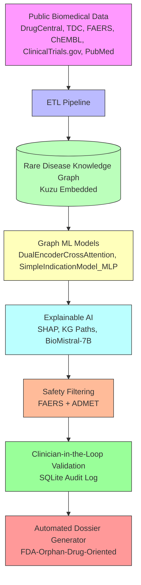

# OrphanRepurpose – AI-Driven Drug Repurposing for Rare & Orphan Diseases
Accelerating therapeutic discoveries for rare diseases by repurposing existing drugs with explainable AI.

OrphanRepurpose is an end-to-end AI platform that identifies and validates drug repurposing opportunities for rare and orphan diseases. It integrates a curated rare-disease knowledge graph, multimodal public datasets, and clinician-in-the-loop explainable AI to generate audit-ready insights for therapeutic development.

[](https://opensource.org/licenses/MIT)
[](https://www.python.org/downloads/)
[](https://pytorch.org/)
[](https://kuzudb.com/)
[](https://fastapi.tiangolo.com/)
[](https://react.dev/)
[](https://vitejs.dev/)
[](https://github.com/topics/ai-for-healthcare)
[](https://github.com/topics/drug-repurposing)
[](https://github.com/topics/graph-neural-network)
[](https://github.com/topics/explainable-ai)
[](https://opensource.org/)

**Star this repo** if you believe in accelerating rare disease treatments through responsible AI.

<details>
<summary>Table of Contents</summary>

- [The Problem](#the-problem)
- [Our Solution](#our-solution)
- [Why OrphanRepurpose?](#why-orphanrepurpose)
- [Key Features](#key-features)
- [Results & Model Performance](#results--model-performance)
  - [What Do These Results Mean?](#what-do-these-results-mean)
- [System Architecture](#system-architecture)
- [Tech Stack](#tech-stack)
- [Project Structure](#project-structure)
- [Getting Started](#getting-started)
- [Demo & Exploration](#demo--exploration)
- [Research Motivation & Real-World Impact](#research-motivation--real-world-impact)
- [Roadmap](#roadmap)
- [Open-Source & Contribution](#open-source--contribution)
- [Citation](#citation)
- [License](#license)
- [Contact](#contact)

</details>

---

## The Problem
There are **7,000+ rare diseases** affecting over **300 million people worldwide**, yet only **~5% have an approved treatment**. Pharmaceutical companies often overlook rare diseases due to small patient populations, high development costs, and uncertain returns. This leaves millions without effective therapies.

Traditional drug discovery takes **10–15 years** and costs **over $2.6 billion** per approved drug. For rare diseases, this model is economically unsustainable, creating a critical gap in medical innovation.

## Our Solution
OrphanRepurpose flips the script by **repurposing existing approved drugs**—bypassing early-stage toxicity and efficacy testing—to rapidly identify new therapeutic indications for rare diseases. The platform combines:

- A **curated rare-disease knowledge graph** (Kuzu embedded) that captures biological relationships
- **Multimodal public datasets** (DrugCentral, TDC, FAERS, ChEMBL, ClinicalTrials.gov, PubMed)
- **Graph neural networks** to predict drug-disease indications
- **Explainable AI** (SHAP, KG paths, LLM rationales) for transparent predictions
- **Safety filtering** using FAERS adverse event reports and ADMET predictions
- **Clinician-in-the-loop validation** with audit trails
- **Automated dossier generation** aligned with FDA Orphan Drug Designation requirements

This approach reduces discovery timelines from years to months and cuts costs by >90%, making rare disease therapeutics feasible.

## Why OrphanRepurpose?
Unlike typical drug repurposing repositories that rely on static CSV datasets or black-box models, OrphanRepurpose delivers a **production-ready, explainable, and auditable system**:

- **Real knowledge graph** – not just a CSV; an embedded Kuzu graph with browsable nodes and edges
- **GNN-based indication prediction** – leveraging graph structure for richer relational learning
- **Explainability-first design** – SHAP values, knowledge graph traversal, and BioMistral-7B generated rationales
- **Clinician-in-the-loop validation** – human oversight with persistent audit logging
- **Safety-aware filtering** – integrates FAERS adverse event signals and TDC ADMET predictions
- **FDA-oriented auditability** – documentation and traceability built for Orphan Drug Designation submissions
- **Automated dossier generation** – compiles evidence into submission-ready documents
- **Interactive KG Browser** – explore the live Kuzu graph with search and statistics
- **End-to-end system** – from public data → KG → AI → Explainability → Safety → Validation → Dossier

## Key Features
- **Builds an explainable rare disease–drug knowledge graph** using Kuzu for dynamic querying and traversal
- **Predicts indications with graph neural networks** (DualEncoderCrossAttention, SimpleIndicationModel_MLP) trained on ChEMBL-augmented data
- **Delivers multi-modal explainability** via SHAP, counterfactuals, KG paths, and LLM-generated rationales
- **Filters unsafe candidates** using FAERS-based adverse event analysis (openFDA) and TDC ADMET predictions
- **Enables clinician validation** through a dedicated interface with SQLite-persisted audit logs
- **Generates FDA-ready dossiers** with credibility mapping and evidence aggregation
- **Provides an interactive KG browser** to explore drugs, diseases, and relationships in real time
- **Offers a full-stack prototype** (FastAPI backend, React/Vite frontend) ready for local deployment

## Results & Model Performance
OrphanRepurpose achieves strong predictive performance on a ChEMBL-augmented benchmark, demonstrating its ability to rank true indications highly—a critical factor for practical drug repurposing.

| Metric | Score |
|--------|-------|
| AUPRC | 0.817 |
| AUROC | 0.807 |
| Expected Calibration Error (ECE) | 0.050 |
| Recall@10 | 78.5% |
| Recall@20 | 91.7% ✅ (Target: ≥70%) |
| Recall@50 | 98.1% |
| Recall@100 | 99.6% |

**Knowledge Graph Statistics**

| Entity | Count |
|--------|-------|
| Drugs | 1,645 |
| Diseases | 1,470 |
| Known indications | 14,578 |
| Drug-target edges | 915 |
| Total nodes | 3,532 |
| Total edges | 15,504 |

### What Do These Results Mean?
High Recall@K values indicate that the model ranks true drug-disease indications within the top K predictions. For drug repurposing, this means clinicians and researchers need to examine far fewer candidates to find viable opportunities—dramatically increasing efficiency in early-stage discovery. A Recall@20 of 91.7% suggests that over 9 in 10 known indications appear in the model’s top 20 predictions, focusing validation efforts where they matter most.

## System Architecture
Data flows from heterogeneous public sources through ETL into a rare disease knowledge graph. Graph ML models generate indication predictions, which are then explained, filtered for safety, validated by clinicians, and compiled into regulatory-ready dossiers.



## Tech Stack
### AI/ML
- PyTorch, PyTorch Geometric
- GraphSAGE, RGCN, DualEncoderCrossAttention, MLP
- SHAP, BioMistral-7B (LLM rationale)

### Knowledge Graph
- Kuzu (embedded graph database)
- Custom rare disease schema with drugs, diseases, targets, indications

### Backend API
- Python 3.13
- FastAPI (RESTful endpoints)
- SQLAlchemy (SQLite persistence)

### Frontend
- React 18
- Vite (build tool)
- KG Browser, Case Studies, Dossier Builder components

### Data Sources
- DrugCentral, TDC, FAERS (openFDA API), ChEMBL
- ClinicalTrials.gov, PubMed

### Explainability & LLMs
- SHAP values
- Knowledge graph traversal for path-based explanations
- BioMistral-7B for natural language rationales

### Storage & Persistence
- SQLite (candidates, audit logs, validations)
- Kuzu (graph persistence)

## Project Structure
```
orphan-repurpose/
├── Brain.md                    # Project vision, roadmap, and technical deep dives
├── Makefile                   # Centralized build, test, and deployment commands
├── docker-compose.yml         # Container orchestration for full-stack demo
├── PROGRESS.md                # Ongoing progress tracking
├── data/                      # Raw and processed data storage
├── docs/                      # Detailed technical documentation
├── pitch/                     # Pitch materials and presentations
├── prototype/                 # Working implementation
│   ├── scripts/etl/           # Data extraction, transformation, loading pipelines
│   ├── models/                # Trained ML model checkpoints
│   └── api/                   # REST API endpoints (FastAPI)
└── .gitignore                 # Git exclusion patterns
```

## Getting Started
Follow these steps to explore OrphanRepurpose locally in under 5 minutes.

### Prerequisites
- Git
- Python 3.9+ (tested with 3.13 recommended)
- pip

### Installation
1. **Clone the repository**
   ```bash
   git clone https://github.com/somenathjana21-ops/orphan-repurpose.git
   cd orphan-repurpose
   ```
2. **Install dependencies**
   ```bash
   # If a requirements.txt exists:
   pip install -r requirements.txt
   # Otherwise install core packages:
   pip install torch torch-geometric kuzu tdc rdkit pandas numpy scikit-learn
   pip install shap  # For SHAP explainability
   ```
   *(Optional) Install frontend dependencies if you wish to run the React UI:*
   ```bash
   cd prototype && npm install  # or yarn install
   ```

### Running the Prototype
- See available commands: `make help`
- Launch the API: `make api-start` (defaults to http://localhost:8000)
- Start the frontend: `cd prototype && npm run dev` (defaults to http://localhost:5173)
- Access the Knowledge Graph Browser at `/kg-browser` in the UI.

**Note:** Trained models and sample data are included in the `prototype/` directory. For full dataset regeneration, run `make etl` (may require additional time and storage).

### Tips
- Use `make test` to run the unit test suite.
- API documentation is available at `/docs` when the server is running.
- Adjust configuration in `prototype/api/config.yaml` if needed.

## Demo & Exploration
Interact with the platform through these core modules:

- **Knowledge Graph Browser** – Search drugs/diseases, view node/edge statistics, explore relationships
- **Drug–Disease Candidate Ranking** – Input a disease and receive ranked repurposing candidates with confidence scores
- **Explainable AI Panel** – View SHAP feature importance, knowledge graph paths supporting a prediction, and LLM-generated rationale
- **Safety & Adverse Event Insights** – Check FAERS-derived safety signals and ADMET properties for any candidate
- **Clinician-in-the-Loop Validation** – Approve/reject candidates with annotations; actions are persisted to an audit log
- **AI-Assisted Dossier Builder** – Compile evidence into a structured draft suitable for FDA Orphan Drug Designation submission

## Research Motivation & Real-World Impact
OrphanRepurpose aims to translate AI innovation into tangible benefits for rare disease patients:

- **Reduces therapeutic discovery time** from years to months by leveraging approved drugs
- **Lowers development risk** through repurposing’s established safety profiles
- **Increases coverage** for the 95% of rare diseases lacking approved treatments
- **Supports evidence-based clinician decisions** with transparent, explainable predictions
- **Generates audit-ready documentation** to accelerate regulatory pathways
- **Democratizes rare disease research** by offering an open-source toolkit for academia and biotech

## Roadmap
Progress is tracked in `Brain.md`. Key milestones:

### Completed ✅
- [x] Knowledge Graph v1 + API (M1)
- [x] Indication Model v1 achieving Recall@20 ≥70% (M2)
- [x] Explainability Stack (SHAP, KG paths, LLM rationales) (M3)
- [x] Safety Filtering with FAERS & ADMET (M4)
- [x] Validation UI with clinician audit logging (M5)
- [x] Automated Dossier Generator (M6)
- [x] Prototype integration and end-to-end demo (M7)

### Upcoming 🚧
- [ ] Series A readiness package (M8)
- [ ] Expansion to additional rare disease datasets (e.g., Orphanet, MONDO)
- [ ] GNN architecture improvements (e.g., attention mechanisms, heterogeneous graphs)
- [ ] Enhanced explainability with multimodal fusion (images, text)
- [ ] Deployment templates for cloud (AWS/Azure) and HPC environments
- [ ] Community-driven benchmarking and leaderboard for rare disease indication prediction

## Open-Source & Contribution
We welcome contributions from developers, researchers, clinicians, and advocates. Whether you’re fixing bugs, adding features, or improving documentation, your help advances rare disease therapeutics.

### How to Contribute
1. Fork the repository
2. Create a feature branch (`git checkout -b feature/amazing-idea`)
3. Commit your changes (`git commit -m "Add amazing feature"`)
4. Push to the branch (`git push origin feature/amazing-idea`)
5. Open a Pull Request

### Contribution Ideas
- **Data** – Curate and integrate additional rare disease datasets (phenotypes, genotypes, literature)
- **Modeling** – Experiment with novel GNN architectures or training strategies
- **Knowledge Graph** – Enrich the schema with new relationship types or properties
- **Explainability** – Improve SHAP visualizations, generate counterfactuals, refine LLM prompts
- **UI/UX** – Enhance the KG Browser, validation workflow, or dossier builder
- **Documentation** – Write tutorials, improve docstrings, add usage examples
- **Evaluation** – Run external benchmarks, compare with baselines, publish results

Please review our [CODE_OF_CONDUCT](CODE_OF_CONDUCT.md) and [CONTRIBUTING](CONTRIBUTING.md) guidelines.

## Citation
If you use OrphanRepurpose in your research, please cite it as:

```bibtex
@misc{orphanrepurpose2026,
  title = {OrphanRepurpose: AI-Driven Drug Repurposing for Rare \& Orphan Diseases},
  author = {Somenath Jana},
  year = {2026},
  publisher = {GitHub},
  journal = {GitHub repository},
  howpublished = {\url{https://github.com/somenathjana21-ops/orphan-repurpose}}
}
```

## License
This project is licensed under the MIT License - see the `LICENSE` file for details.

## Contact
Somenath Jana - somenathjana21@gmail.com

**Built to help accelerate therapeutic discoveries for the millions living with rare and orphan diseases.**