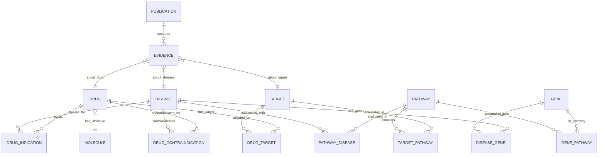
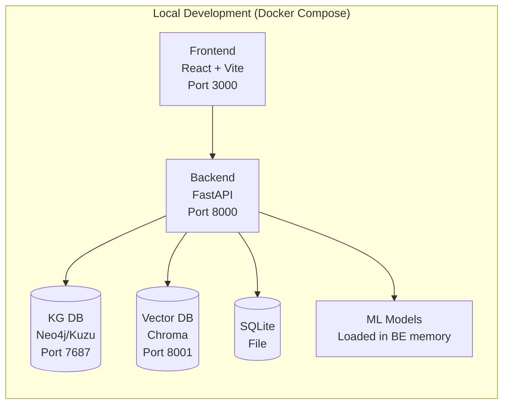
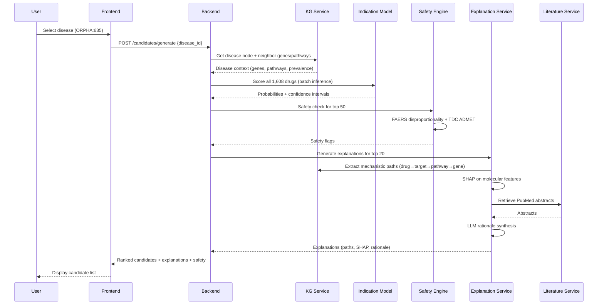

# System Architecture — OrphanRepurpose

**Project**: OrphanRepurpose — AI-Driven Drug Repurposing for Rare & Orphan Diseases
**Version**: 1.0
**Date**: 2026-10-08

---

## 1. High-Level Architecture


---

## 2. Component Details

### 2.1 Frontend (React 18 + TypeScript + Vite)

```
frontend/
├── src/
│   ├── components/
│   │   ├── DiseaseBrowser.tsx      # Search, filter, list
│   │   ├── DiseaseDetail.tsx       # Overview, genes, pathways
│   │   ├── CandidateList.tsx       # Ranked table, filters
│   │   ├── CandidateDetail.tsx     # Tabs: Explanation, KG, Lit, Safety, Validation
│   │   ├── KGGraph.tsx             # Cytoscape.js interactive subgraph
│   │   ├── ExplanationPanel.tsx    # KG paths + LLM rationale + SHAP
│   │   ├── SafetyDashboard.tsx     # FAERS + ADMET flags
│   │   ├── ValidationPanel.tsx     # Simulated clinician + self-assessment
│   │   ├── DossierBuilder.tsx      # Section editor, preview
│   │   ├── AuditTrail.tsx          # Timeline, export
│   │   └── DisclaimerBanner.tsx    # Research prototype notice
│   ├── hooks/
│   │   ├── useDiseases.ts
│   │   ├── useCandidates.ts
│   │   ├── useKG.ts
│   │   └── useAudit.ts
│   ├── services/
│   │   └── api.ts                  # Axios client + types
│   ├── types/
│   │   └── index.ts                # Shared TypeScript interfaces
│   └── App.tsx
├── package.json
├── tsconfig.json
├── vite.config.ts
└── tailwind.config.js
```

**Key Libraries**:
- `react`, `react-dom`, `react-router-dom`
- `@tanstack/react-query` (server state)
- `cytoscape`, `cytoscape-cose-bilkent` (KG visualization)
- `tailwindcss` (styling)
- `zustand` (client state)
- `axios` (API client)
- `recharts` (charts for scores)
- `react-markdown` (LLM rationale rendering)

### 2.2 Backend (FastAPI + Python 3.11)

```
backend/
├── app/
│   ├── api/
│   │   ├── v1/
│   │   │   ├── diseases.py         # Disease search, detail
│   │   │   ├── candidates.py       # Generation, ranking, detail
│   │   │   ├── kg.py               # Subgraph queries
│   │   │   ├── literature.py       # PubMed search, summarization
│   │   │   ├── validation.py       # Validation logging
│   │   │   ├── dossier.py          # Generation, export
│   │   │   └── audit.py            # Audit trail query
│   │   └── deps.py                 # Dependency injection
│   ├── core/
│   │   ├── config.py               # Settings (pydantic-settings)
│   │   ├── security.py             # No auth for prototype
│   │   └── logging.py              # Structured logging
│   ├── models/
│   │   ├── disease.py
│   │   ├── candidate.py
│   │   ├── kg.py
│   │   ├── validation.py
│   │   ├── dossier.py
│   │   └── audit.py
│   ├── services/
│   │   ├── kg_service.py           # KG queries, path finding
│   │   ├── candidate_service.py    # Orchestration
│   │   ├── explanation_service.py  # KG paths + LLM + SHAP
│   │   ├── safety_service.py       # FAERS + ADMET
│   │   ├── literature_service.py   # PubMed + LLM summary
│   │   ├── dossier_service.py      # Template rendering
│   │   └── audit_service.py        # Immutable logging
│   ├── ml/
│   │   ├── indication_model.py     # Wrapper for PyTorch model
│   │   ├── admet_models.py         # TDC model wrappers
│   │   └── llm_client.py           # HF Transformers wrapper
│   └── main.py                     # FastAPI app factory
├── tests/
├── requirements.txt
├── pyproject.toml
└── Dockerfile
```

**Key Libraries**:
- `fastapi`, `uvicorn`, `pydantic`, `pydantic-settings`
- `sqlalchemy` + `aiosqlite` (relational)
- `neo4j` or `kuzu` (KG)
- `chromadb` or `faiss` (vector store for literature)
- `networkx` (graph algorithms)
- `rdkit` (molecular featurization)
- `torch`, `torch-geometric` (GNN)
- `transformers`, `accelerate` (LLM)
- `scikit-learn` (calibration, conformal prediction)
- `jinja2` (dossier templates)
- `weasyprint` or `reportlab` (PDF generation)
- `pytest`, `pytest-asyncio`, `httpx` (testing)

### 2.3 ML Reasoning Engine

#### 2.3.1 Indication Prediction Model
```
Architecture: Dual-Encoder Cross-Attention
├── Drug Encoder: Molecular GNN (GraphSAGE/GAT)
│   ├── Input: SMILES → Molecular graph (RDKit)
│   ├── Layers: 3× GraphSAGE (hidden=256)
│   ├── Readout: Global mean pooling
│   └── Output: Drug embedding (256-d)
├── Disease Encoder: KG Node Embedding Lookup
│   ├── Input: Disease node ID
│   ├── Source: Pre-trained KG embeddings (RGCN)
│   └── Output: Disease embedding (256-d)
├── Cross-Attention: Multi-head (4 heads, 256-d)
│   ├── Query: Disease, Key/Value: Drug (and vice versa)
│   └── Output: Fused representation (512-d)
└── Prediction Head: MLP (512→256→1) + Sigmoid
    ├── Output: Indication probability
    └── Calibration: Temperature scaling + Conformal prediction
```

**Training Data**:
- Positive: DrugCentral known indications (drug-disease pairs)
- Negative: Contraindications + random unconnected pairs (1:4 ratio)
- Validation: TDC drug-disease indication benchmarks + temporal holdout
- Loss: Focal loss (γ=2) + Calibration loss (ECE)

#### 2.3.2 KG Embeddings (Pre-training)
- **Method**: RGCN (Relational GCN) on heterogeneous KG
- **Relations**: 15+ types (binds, activates, inhibits, treats, causes, part_of, etc.)
- **Dimensions**: 256
- **Training**: Link prediction (transductive) on held-out edges
- **Inference**: Frozen embeddings for disease encoder

#### 2.3.3 ADMET Models
- **Source**: TDC pre-trained models (downloaded via TDC API)
- **Endpoints**: 22 ADMET properties (Caco2, HIA, CYP inhibition/substrate, half-life, clearance, toxicity)
- **Format**: PyTorch checkpoints or ONNX for fast inference
- **Wrapper**: Unified `predict_admet(smiles: str) -> Dict[str, float]`

#### 2.3.4 LLM Rationale Generator
- **Base Model**: Biomedical LLM (e.g., `microsoft/BiomedNLP-PubMedBERT-base-uncased-abstract` fine-tuned, or `BioMistral-7B` quantized)
- **Input**: Structured prompt with KG paths, drug/disease names, MoA
- **Output**: 2-3 sentence mechanistic rationale
- **Fine-tuning**: On expert-written rationales (synthetic + literature-derived)

#### 2.3.5 Explainability Stack
1. **KG Path Extraction**: Yen's k-shortest paths (k=3) from drug to disease genes via targets/pathways
2. **SHAP**: KernelSHAP on molecular fingerprints (Morgan, 1024-bit)
3. **Counterfactual**: "Remove edge X→Y, probability changes by Z%"
4. **LLM Rationale**: Natural language synthesis

### 2.4 Data & Knowledge Layer

#### 2.4.1 Knowledge Graph Schema


#### 2.4.2 Data Pipeline (ETL)
```
scripts/
├── etl/
│   ├── download_orpha.py         # Orphanet XML → KG nodes
│   ├── download_drugcentral.py   # DrugCentral TSV → KG nodes/edges
│   ├── download_tdc.py           # TDC datasets → Parquet + model weights
│   ├── download_faers.py         # FAERS quarterly → disproportionality calc
│   ├── download_chembl.py        # ChEMBL targets, bioactivity
│   ├── download_reactome.py      # Reactome pathways, genes
│   ├── download_pubmed.py        # PubMed abstracts (targeted queries)
│   ├── build_kg.py               # NetworkX → Neo4j/Kuzu import
│   ├── train_kg_embeddings.py    # RGCN training
│   ├── train_indication_model.py # Dual-encoder training
│   └── generate_synthetic.py     # Synthetic data for gaps
```

---

## 3. API Design (REST + WebSocket)

### 3.1 Core Endpoints

| Method | Path | Description |
|--------|------|-------------|
| `GET` | `/api/v1/diseases` | Search diseases (q, filters, page) |
| `GET` | `/api/v1/diseases/{orpha_id}` | Disease detail |
| `POST` | `/api/v1/candidates/generate` | Generate candidates for disease |
| `GET` | `/api/v1/candidates/{candidate_id}` | Candidate detail |
| `GET` | `/api/v1/candidates/{candidate_id}/explanation` | Mechanistic explanation |
| `GET` | `/api/v1/candidates/{candidate_id}/kg-subgraph` | KG subgraph (Cytoscape JSON) |
| `GET` | `/api/v1/candidates/{candidate_id}/literature` | Literature evidence |
| `GET` | `/api/v1/candidates/{candidate_id}/safety` | Safety flags |
| `POST` | `/api/v1/candidates/{candidate_id}/validate` | Log validation |
| `POST` | `/api/v1/dossier/generate` | Generate Orphan Designation draft |
| `GET` | `/api/v1/audit/{session_id}` | Audit trail |
| `WS` | `/ws/generate/{disease_id}` | Real-time candidate generation progress |

### 3.2 Key Data Models (Pydantic)

```python
# Disease
class Disease(BaseModel):
    orpha_id: str
    name: str
    prevalence: Optional[float]
    genes: List[Gene]
    pathways: List[Pathway]
    phenotypes: List[str]
    existing_treatments: List[Drug]
    unmet_need_score: float

# Candidate
class Candidate(BaseModel):
    drug_id: str
    drug_name: str
    indication_probability: float
    confidence_interval: Tuple[float, float]  # Conformal prediction
    moa_summary: str
    safety_flags: SafetyFlags
    kg_paths: List[KGPath]
    llm_rationale: str
    shap_values: Dict[str, float]

# SafetyFlags
class SafetyFlags(BaseModel):
    faers_signals: List[FAERSSignal]  # ROR, PRR, BCPNN
    admet_predictions: Dict[str, float]  # 22 TDC endpoints
    contraindications: List[str]
    overall: Literal["pass", "caution", "fail"]

# Dossier
class DossierRequest(BaseModel):
    disease_id: str
    candidate_ids: List[str]
    include_sections: List[str]  # ["background", "rationale", "preclinical", "regulatory", "credibility_map"]

class DossierResponse(BaseModel):
    pdf_base64: str
    json: DossierJSON
    audit_trail_id: str
```

---

## 4. Deployment Architecture (Prototype)



**Docker Compose Services**:
- `frontend`: Node 20, Vite dev server (hot reload)
- `backend`: Python 3.11, FastAPI + Uvicorn (reload)
- `neo4j`: Neo4j 5.x (or `kuzu` embedded — no separate service)
- `chroma`: ChromaDB for literature embeddings
- `ml-models`: Shared volume with model weights

**Production Considerations (Post-MVP)**:
- Kubernetes (EKS/GKE)
- PostgreSQL + pgvector (replace SQLite + Chroma)
- Neo4j Aura / Kubernetes Operator
- Model serving: Triton / TorchServe / BentoML
- Auth: OAuth2/OIDC (Auth0/Keycloak)
- Audit: Immutable object storage (S3 + WORM)

---

## 5. Technology Choices & Justification

| Layer | Choice | Justification |
|-------|--------|---------------|
| **Backend API** | FastAPI | Async, auto OpenAPI, type-safe, fast |
| **Frontend** | React + TypeScript + Vite | Ecosystem, type safety, fast HMR |
| **Styling** | Tailwind CSS | Utility-first, scientific UI density |
| **KG Database** | Kuzu (embedded) or Neo4j | Kuzu: zero-dep, fast, Cypher-compatible; Neo4j: mature |
| **Vector Store** | ChromaDB | Python-native, persistent, filtered search |
| **Relational** | SQLite (prototype) → PostgreSQL | Zero-config prototype, easy migration |
| **ML Framework** | PyTorch + PyG | GNN standard, dynamic graphs, production-ready |
| **Molecular** | RDKit | Industry standard, comprehensive |
| **LLM** | HuggingFace Transformers | Local inference, no API keys, quantizable |
| **Graph Viz** | Cytoscape.js | Web-based, performant, interactive |
| **PDF Gen** | WeasyPrint | HTML/CSS → PDF, supports complex layouts |
| **Container** | Docker Compose | Single-command local dev |
| **Testing** | pytest + httpx + Playwright | Unit, integration, E2E |
| **Linting** | ruff + mypy + eslint | Fast, comprehensive |

---

## 6. Data Flow: Candidate Generation



---

## 7. Security & Compliance (Prototype)

| Concern | Approach |
|---------|----------|
| **Authentication** | None (prototype) — single user, local only |
| **Authorization** | N/A |
| **Data Privacy** | No PHI/PII — all public/synthetic data |
| **Secrets** | `.env.example` only, `.env` in `.gitignore` |
| **Audit Trail** | Append-only JSONL, tamper-evident hash chain |
| **Disclaimers** | Banner on all pages, in exports, in API responses |
| **Model Cards** | Each model has card: training data, limitations, intended use |

---

## 8. Observability

| Metric | Tool |
|--------|------|
| **API Latency** | FastAPI middleware + Prometheus histogram |
| **Model Inference Time** | Custom middleware per ML endpoint |
| **Error Rates** | Structured logging (structlog) + Sentry (optional) |
| **Audit Trail Integrity** | Hash chain verification on read |
| **Data Freshness** | ETL job timestamps in metadata table |

---

## 9. ADR References

- ADR-001: Idea Selection (OrphanRepurpose)
- ADR-002: KG Database Choice (Kuzu vs Neo4j) — *to be written*
- ADR-003: ML Framework (PyTorch/PyG) — *to be written*
- ADR-004: LLM Choice (Local HF vs API) — *to be written*
- ADR-005: Frontend Framework (React/Vite) — *to be written*

---

*End of Architecture Doc v1.0*