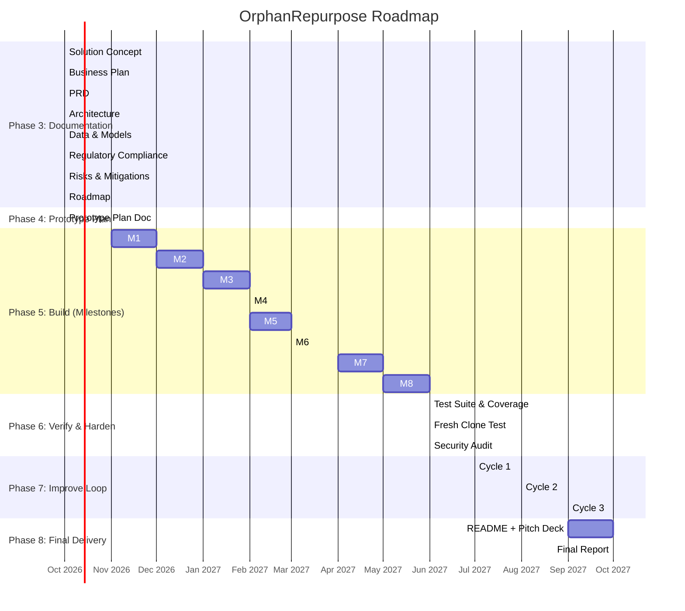

# Roadmap — OrphanRepurpose

**Project**: OrphanRepurpose — AI-Driven Drug Repurposing for Rare & Orphan Diseases
**Version**: 1.0
**Date**: 2026-10-08

---

## 1. Strategic Phases



---

## 2. Phase 4: Prototype Plan (doc/08_prototype_plan.md)

**Deliverable**: Detailed prototype plan with MVP scope, user stories → tests traceability, tech stack, data sources, ML approach, evaluation metrics, milestones, testing strategy.

**Timeline**: 1 week (Week 1 of build phase)

**Key Decisions to Document**:
- MVP feature list (3-5 core features) with explicit out-of-scope
- Tech stack finalization (Kuzu vs Neo4j, BioMistral vs PubMedBERT)
- Data download & processing scripts
- Model training pipeline (TDC integration, KG embeddings)
- Evaluation benchmarks & success criteria
- Demo scenario (Niemann-Pick Type C, ORPHA:635)

---

## 3. Phase 5: Build — Milestone Details

### M1: Knowledge Graph v1 + API (Month 1-2) — **Target: 2026-12-15**

**Scope**:
- ETL pipeline for all 8 primary datasets (Orphanet, DrugCentral, TDC, FAERS, ChEMBL, Reactome, PubMed, UniProt)
- KG schema implementation in Kuzu (embedded) or Neo4j
- GraphQL + REST API for disease/drug queries
- KG embedding training (RGCN, 256-d)
- Basic frontend: Disease browser with search/filter

**Demoable Outcome**: 
```
$ make demo-kg
# Loads KG, runs query: "Show all drugs targeting NPC1 pathway for Niemann-Pick Type C"
# Returns interactive subgraph in frontend
```

**Tests**:
- KG node/edge counts match expected
- Identifier mapping accuracy >95% (sample audit)
- API response <500ms for single-node queries
- Embedding quality: MRR >0.3, Hits@10 >0.5 on link prediction

**Dependencies**: Data downloads, Kuzu/Neo4j setup, RDKit for molecular nodes

---

### M2: Indication Prediction Model v1 (Month 2-3) — **Target: 2027-01-31**

**Scope**:
- Drug encoder: GraphSAGE on molecular graphs (RDKit)
- Disease encoder: KG embedding lookup
- Cross-attention fusion + prediction head
- Training on DrugCentral indications (temporal split)
- Calibration: Temperature scaling + Conformal prediction
- Batch inference for all 1,608 drugs
- API endpoint: POST /candidates/generate

**Demoable Outcome**:
```
$ make demo-candidates
# Input: ORPHA:635 (Niemann-Pick Type C)
# Output: Top 20 ranked drugs with probabilities + 90% CIs
```

**Tests**:
- AUPRC ≥0.45 on TDC drug-disease benchmark
- Recall@20 ≥70% on RepoDB holdout
- ECE ≤0.05 after calibration
- Conformal coverage 90% ± 2%
- Inference latency <100ms for 1,608 drugs (GPU)

**Dependencies**: M1 (KG embeddings), DrugCentral training pairs, TDC benchmarks

---

### M3: Explainability Stack (Month 3-4) — **Target: 2027-02-28**

**Scope**:
- KG path extraction: Yen's k-shortest paths (k=3) drug→target→pathway→gene→disease
- SHAP: KernelSHAP on Morgan fingerprints for top candidates
- Counterfactual: Edge ablation on top paths
- LLM Rationale: BioMistral-7B (4-bit) or PubMedBERT fine-tuned
- Frontend: ExplanationPanel with tabs (Paths, SHAP, Counterfactual, LLM)

**Demoable Outcome**:
```
$ make demo-explain
# For top candidate (e.g., miglustat for NPC), shows:
# 1. KG paths: miglustat → GBA → glycosphingolipid pathway → NPC1 → NPC
# 2. SHAP: Important substructures (imino sugar moiety)
# 3. Counterfactual: "Removing GBA→pathway edge drops prob by 0.23"
# 4. LLM: "Miglustat inhibits GBA, reducing substrate accumulation in NPC1-deficient cells..."
```

**Tests**:
- Path extraction finds ≥1 path for >90% of known indications
- SHAP values correlate with known pharmacophores (literature check)
- LLM rationale BERTScore F1 ≥0.7 vs expert rationales (50 cases)
- Frontend renders <3 sec for 50-node subgraph

**Dependencies**: M1 (KG), M2 (model), LLM model weights

---

### M4: Safety Filter (Month 4) — **Target: 2027-02-28** (parallel with M3)

**Scope**:
- FAERS disproportionality: ROR, PRR, BCPNN for all drug-reaction pairs
- TDC ADMET predictions: 22 endpoints for 1,608 drugs (pre-computed)
- Contraindication check from DrugCentral
- Safety dashboard: Pass/Caution/Fail with drill-down
- API: GET /candidates/{id}/safety

**Demoable Outcome**:
```
$ make demo-safety
# For candidate list, shows safety flags:
# - Miglustat: FAERS ROR=2.1 for neuropathy (caution), ADMET: CYP3A4 substrate (pass)
# - Candidate X: FAERS BCPNN >3 for hepatotoxicity (fail) → filtered
```

**Tests**:
- FAERS signal detection: Precision ≥85% on known withdrawals (validation set)
- ADMET predictions match TDC leaderboard within 5%
- Safety filter reduces false positives by ≥30% vs no filter
- API response <1 sec

**Dependencies**: M1 (KG for drug IDs), TDC models, FAERS local extracts

---

### M5: Validation UI (Month 5) — **Target: 2027-03-31**

**Scope**:
- Simulated clinician validation: "Plausible/Needs Data/Unlikely" with rationale
- Self-assessment: Efficacy/Safety/Feasibility (1-5) + notes
- Audit trail logging (immutable JSONL with hash chain)
- Validation history view per candidate
- Export validation record

**Demoable Outcome**:
```
$ make demo-validation
# Shows validation panel for miglustat:
# - Simulated Dr. Smith: "Plausible - strong mechanistic rationale, needs NPC1 binding data"
# - Self-assessment: Efficacy 4, Safety 5, Feasibility 4
# - Audit log shows timestamped entries
```

**Tests**:
- Audit log integrity: hash chain verifies
- Validation data included in dossier export
- Simulated clinician covers ≥3 personas (neurologist, geneticist, pharmacologist)

**Dependencies**: M3 (explanations), M4 (safety), audit log infrastructure

---

### M6: Dossier Generator (Month 5) — **Target: 2027-03-31** (parallel with M5)

**Scope**:
- Jinja2 templates for Orphan Drug Designation sections
- Auto-populate: Disease background, Drug profile, Mechanistic rationale, Preclinical plan, Regulatory strategy, 7-step credibility map
- PDF export (WeasyPrint) + JSON export
- 7-step credibility evidence package per model
- API: POST /dossier/generate

**Demoable Outcome**:
```
$ make demo-dossier
# Generates complete Orphan Designation draft for miglustat + NPC
# Includes: 15-page PDF with all sections + credibility appendix
```

**Tests**:
- All 7 FDA credibility steps addressed with evidence
- PDF renders without errors
- JSON schema validates
- Dossier includes audit trail reference

**Dependencies**: M1-M5 (all data), template design, WeasyPrint

---

### M7: Pilot with 3 Customers (Month 6-7) — **Target: 2027-05-31**

**Scope**:
- Recruit 3 pilot partners (1 foundation, 1 biotech, 1 academic)
- 3-month evaluation program
- Weekly check-ins, feedback collection
- Case study documentation (validated candidates, time saved)
- Iterate on UI/UX based on feedback

**Demoable Outcome**:
- 3 signed pilot agreements
- 2+ validated repurposing candidates per pilot
- Case studies drafted for marketing
- NPS ≥40

**Dependencies**: M6 (complete platform), sales outreach, legal agreements

---

### M8: Series A Ready (Month 8) — **Target: 2027-06-30**

**Scope**:
- 10 paying customers ($750K ARR)
- 3 published case studies
- FDA Orphan Designation draft used in ≥1 real submission
- TDC benchmark: Top 10 on drug-disease indication
- Team: 18 FTE, repeatable sales motion
- Data room ready for due diligence

**Demoable Outcome**:
- Investor deck with traction metrics
- Financial model updated with actuals
- Technical due diligence package (architecture, IP, data licenses)

**Dependencies**: M7 success, fundraising preparation

---

## 4. Phase 6: Verify & Harden (Month 8) — **Target: 2027-06-30**

| Activity | Criteria | Tools |
|----------|----------|-------|
| **Unit Tests** | ≥80% coverage on core modules (KG, model, safety, dossier) | pytest, coverage.py |
| **Integration Tests** | Full pipeline: disease → candidates → explanations → dossier | pytest-asyncio, httpx |
| **E2E Tests** | Critical user journeys (5 scenarios) | Playwright |
| **Fresh Clone Test** | `git clone → make setup → make run → make demo` succeeds | Clean VM/container |
| **Security Audit** | No critical vulns, no secrets, dependency scan clean | Trivy, bandit, npm audit |
| **Performance** | All NFR targets met (latency, throughput) | Locust, custom benchmarks |
| **Lint/Type Check** | ruff, mypy, eslint clean | CI pipeline |

---

## 5. Phase 7: Improve Loop (Months 9-11) — 3 Cycles

### Cycle 1 (Month 9): Skeptical Buyer/VC Critique
- **Buyer Persona**: "Why not Healx? Show me a candidate that worked in wet lab."
- **VC Persona**: "TAM too small. How do you scale beyond rare diseases?"
- **Action**: Targeted research on competitive differentiation, market expansion
- **Deliverable**: Top 5 weaknesses + fixes prioritized

### Cycle 2 (Month 10): Implement High-Value Fixes
- Address top 3 weaknesses from Cycle 1
- Re-test, update metrics
- **Deliverable**: Improved demo, updated benchmarks

### Cycle 3 (Month 11): Final Polish
- UI/UX refinements, edge cases, documentation
- Pitch deck finalization
- **Deliverable**: Production-ready prototype

---

## 6. Phase 8: Final Delivery (Month 11-12) — **Target: 2027-10-31**

| Deliverable | Description |
|-------------|-------------|
| **README.md** | Overview, screenshots/ASCII walkthrough, quickstart, architecture summary, doc index |
| **Pitch Deck** | 12-15 slides (problem, solution, market, traction, team, ask) |
| **One-Pager** | Executive summary for investors |
| **Final Brain.md** | Status: COMPLETE, recommended 90-day plan for real company |
| **Final Report** | Summary of everything built, how to run, key metrics, limitations, 90-day plan |

---

## 7. Resource Allocation (Build Phase)

| Role | Month 1-2 | Month 3-4 | Month 5 | Month 6-7 | Month 8 |
|------|-----------|-----------|---------|-----------|---------|
| **ML Lead** | KG embeddings, data | Indication model | Explainability | Model eval, pilot support | Benchmarks, investor tech DD |
| **Backend Lead** | KG API, ETL | Candidate API, safety | Validation API, audit | Dossier API, pilot integration | Hardening, security, perf |
| **Frontend Lead** | Disease browser | Candidate list, detail | Explanation panels, KG viz | Validation UI, dossier builder | Polish, accessibility, testing |
| **Data Engineer** | All ETL pipelines | FAERS, TDC integration | Literature mining | Pilot data needs | Data licensing, compliance |
| **Regulatory/Clinical** | — | COU docs, 7-step mapping | Validation design | Dossier templates, pilot reg support | GxP roadmap, FDA engagement |
| **CEO/Founder** | Fundraising, hiring | Pilot recruitment | Pilot management | Sales, fundraising | Series A close |

---

## 8. Budget Overview (Build Phase, 8 Months)

| Category | Month 1-2 | Month 3-4 | Month 5 | Month 6-7 | Month 8 | Total |
|----------|-----------|-----------|---------|-----------|---------|-------|
| **Personnel (6 FTE)** | $240K | $240K | $120K | $240K | $120K | $960K |
| **Compute (GPU cloud)** | $10K | $20K | $10K | $10K | $5K | $55K |
| **Data Licenses** | $5K | $5K | $0 | $10K | $0 | $20K |
| **Legal/IP** | $10K | $5K | $5K | $10K | $20K | $50K |
| **Tools/SaaS** | $2K | $2K | $2K | $2K | $2K | $10K |
| **Travel/Conferences** | $5K | $5K | $5K | $10K | $10K | $35K |
| **Buffer (15%)** | $40K | $41K | $21K | $41K | $23K | $166K |
| **Total** | **$312K** | **$318K** | **$158K** | **$323K** | **$180K** | **$1.29M** |

*Note: Seed round $2M covers 18 months including post-MVP*

---

## 9. Success Metrics by Phase

| Phase | Key Metrics |
|-------|-------------|
| **Phase 4 (Plan)** | Plan doc complete, all decisions documented, team aligned |
| **Phase 5 (Build)** | Each milestone demoable, tests passing, metrics documented |
| **Phase 6 (Verify)** | All gates pass: coverage ≥80%, fresh clone works, security clean |
| **Phase 7 (Improve)** | 3 cycles complete, weaknesses addressed, demo polished |
| **Phase 8 (Delivery)** | README/pitch/one-pager done, final report sent, Brain.md COMPLETE |

---

## 10. Go/No-Go Gates

| Gate | Criteria | Decision |
|------|----------|----------|
| **Post-M1** | KG loads, queries work, embeddings trained | Continue / Re-architect KG |
| **Post-M2** | Indication model AUPRC ≥0.40 (minimum viable) | Continue / Simplify model |
| **Post-M4** | Safety filter precision ≥80% | Continue / Reduce safety scope |
| **Post-M6** | Full pipeline works end-to-end | Continue / Cut features |
| **Post-M7** | ≥2 pilots convert to paid | Pivot / Proceed to Series A |
| **Post-Phase 6** | All verify gates pass | Ship / Extend hardening |

---

## 11. 90-Day Plan for Real Company (Post-Prototype)

| Month | Focus | Key Activities |
|-------|-------|----------------|
| **1-2** | **Team & Legal** | Incorporate (DE C-corp), hire founding engineer, file provisional patents, negotiate data licenses |
| **2-3** | **Product-Market Fit** | 10 discovery calls with biotech/foundations, refine ICP, close 2 paid pilots ($50K each) |
| **3** | **Fundraise** | Series A materials, investor outreach, target $10M at $40M pre |
| **3-6** | **Scale Platform** | GxP infrastructure, multi-tenant, RBAC, model monitoring, federation |
| **6-12** | **Traction** | 20 customers, 50+ candidates delivered, 5+ wet-lab validations, first Orphan Designation filing |

---

*End of Roadmap v1.0*